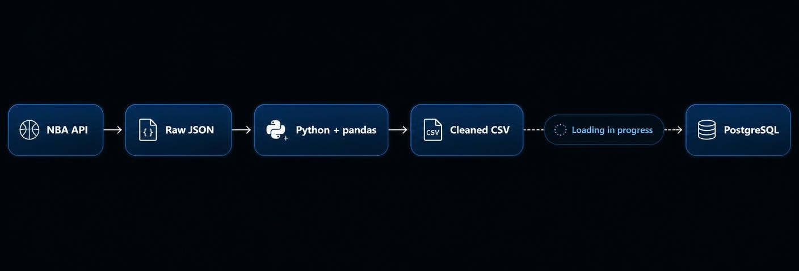

# NBA Player Game Log Pipeline

A work-in-progress data engineering project that extracts NBA player game logs, prepares them for analysis, and loads them into PostgreSQL. The long-term goal is to serve the modeled data through an API and React dashboard for player trend analysis.

## Architecture



## Data flow

1. **Extract** regular-season player game logs from the NBA Stats API and save a timestamped raw JSON response.
2. **Transform** the source fields into a consistent schema, normalize column names and data types, and check required fields and duplicate player-game records.
3. **Load** the prepared records into the PostgreSQL `fact_player_game_logs` table.
4. **Visualize (planned)** player trends and summaries through an API-backed React dashboard.

The current extraction script targets the `2025-26` regular season. The database schema includes player and team identifiers, game details, box-score statistics, shooting percentages, and plus/minus.

## Technologies

- Python and pandas
- `nba_api`
- PostgreSQL 17
- SQLAlchemy and psycopg2
- Docker Compose
- React (planned)

## Project structure

```text
.
├── docker-compose.yml
└── etl/
    ├── .env.example
    └── app/
        ├── data/
        │   ├── raw/
        │   └── processed/
        ├── db/
        │   ├── connection.py
        │   └── schema.sql
        ├── extract/
        ├── transform/
        └── load/
```

## Local setup

### Prerequisites

- Python 3.10+
- Docker with Docker Compose

### 1. Clone the repository

```bash
git clone https://github.com/jaeke131/NBA-Pipeline.git
cd NBA-Pipeline
```

### 2. Create a Python environment and install the current dependencies

```bash
python -m venv .venv
source .venv/bin/activate
python -m pip install pandas nba_api SQLAlchemy psycopg2-binary python-dotenv requests
```

On Windows PowerShell, activate the environment with `.venv\Scripts\Activate.ps1`.

> `etl/app/requirements.txt` is not populated yet, so the dependencies are listed explicitly for now.

### 3. Configure and start PostgreSQL

```bash
cp etl/.env.example etl/.env
docker compose up -d postgres
python -m etl.app.load.create_tables
```

The example environment file matches the development credentials in `docker-compose.yml`. Do not reuse these credentials in a deployed environment.

### 4. Run the extractor

The extractor currently uses a path relative to `etl/app`, so run it from that directory:

```bash
cd etl/app
python -m extract.extract_player_game_logs
```

A successful request writes a timestamped JSON response to `etl/app/data/raw/` and prints the extracted record count.

## Current status

| Component | Status |
| --- | --- |
| NBA player game-log extraction | Implemented |
| Timestamped raw JSON storage | Implemented |
| Source-column and type validation | In progress |
| PostgreSQL container and fact-table schema | Implemented |
| Table creation script | Implemented |
| Transformed-data output and database load | Not yet complete |
| API and React dashboard | Planned |
| Automated tests and scheduled runs | Planned |

## Next milestones

- Complete the transformation output and duplicate-record handling.
- Implement an idempotent PostgreSQL load for player-game records.
- Populate and pin `requirements.txt` for reproducible setup.
- Add tests for schema validation and transformation behavior.
- Add analytical SQL views for recent-game and season-level player summaries.
- Build an API layer, then connect the React dashboard.

## Data source

Game-log data is retrieved through the community-maintained [`nba_api`](https://github.com/swar/nba_api) client for NBA.com endpoints. This project is for educational and portfolio use.
